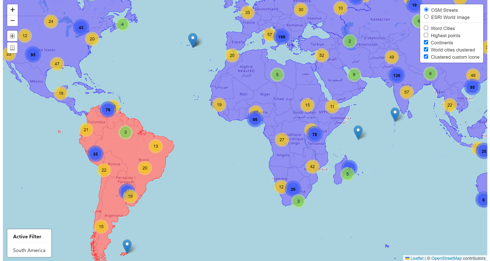

# React Leaflet Mapa

Esse aplicativo foi desenvolvido no curso <a href="https://www.udemy.com/course/react-leaflet-with-hooks/" target="_blank">React Leaflet (with hooks)</a> , tem como objetivo aprender sobre as bibliotecas react-leaflet e leaflet.

## 🔨 Funcionalidades do projeto

Esse aplicativo exibe um mapa múndi completo onde é possível aplicar filtros de continente.

## ✔️ Técnicas e tecnologias utilizadas

Lista das bibliotecas utilizadas no desenvolvimento do Mapa:

- `React`
- `React Hooks`
- `leaflet`
- `react-leaflet`
- `antd`
- `react-leaflet-cluster    `
- `leaflet-routing-machine`

## 🛠️ Abrir e rodar o projeto

Para abrir e rodar o projeto, execute npm i para instalar as dependências e npm start para inicar o projeto.

Depois, acesse <a href="http://localhost:3000/" target="_blank">http://localhost:3000/</a> no seu navegador. 

